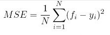

# Linear Regression

## Goal & Definition
Equation to relate an independent variable to predict a dependent variable. You can have any number of dependent and independent variables.

e.g Equation to take a lot size and figure out the pice of the lot.

## Method of solving Linear Regression

- Ordinary Least Sqaures
- Generalized Least Squares
- Gradient Descent
- etc

## Gradient Descent

We can tell how bad our guess is based on the information we are looking at but Computers can't tell how bad your equation is by simply looking at data.

There is a way though that computers can use to tell how wrong we are in terms of probability. 

- N = Number of data point
- i = 
- fi = Value returned by the model or  (Guess)
- yi = Actual value of dataq point i. (Actual)

  Smaller the MSE, better the guess is.

 Looking at the trend line for MSE vs our guess, we can
 - by looking at the shape of the line can guess if the best MSE values is on the left or right
 - Take a small portion of the points on the line and observe the shape,if 
   - vertical - we are way off
   - slightly vertical leaning left, optiomal MSE is on the right side and vice versa

 ### Side Note Derivatives
 You want to know the slope at any location - use derivatives

 - negative value of derivative, can tell slope is leaning left or coming down
 - positive value of the derivative, can tell slope is leaning right or going up

### Algorithm

 - Pick a value of 'b'( our guess) to start with 
 - Calculate the slope of MSE using the value of b (this is where the derivative will come in handy, we will do the derivative of MSE value and get a new equation that will depepend on 'b')
 - Is the slope small and close to zero? yes break the loop
 - multiply teh slope by an arbritary value (learning rate)
 - subtract from 'b'
 - loop back to step 2

##### Learning Rate used in the algorithm

 - The value of slope is meaningless and the only thing that is usefull is the sign of the value
 - Learning rate helps get the guessed value converge on gradient descent.
 - The learning rate is a hyperparameter that controls how much to change the model in response to the estimated error each time the model weights are updated. 

## Calculation Accuracy

- Coefficient for Determination
  - SS(tot)
    - Sum of Squares of total
    - Property of dataset
    - 
  - SS(res)
    - sum of squares of residual
    - depends on predicted value

## Multivariate Regression

### Multivariate linear regression
y = b + (m1 * Weight) + (m2 * Displacement) + (m3 * hp)

## Learning Rate Optimization

  ### Method to adjust Learning Rate
  - Adam
  - Adagrad
  - RMSProp
  - Momentum

 ### Our Custom Learning Rate Optimation 
   - With ever GD, calculate MSE and save it
   - Another GD run, get MSE for it and compare it with what was saved in previous step.
   - IF MSE went up, the bad update, so divide learning rate by 2
   - IF MSE went down, increase Learning rate by 5%.

  

